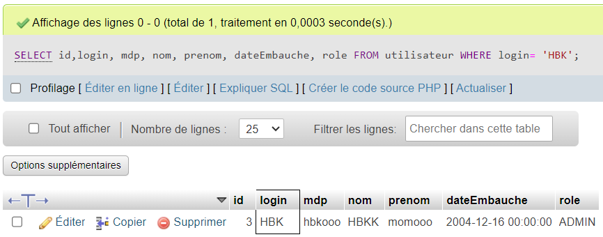
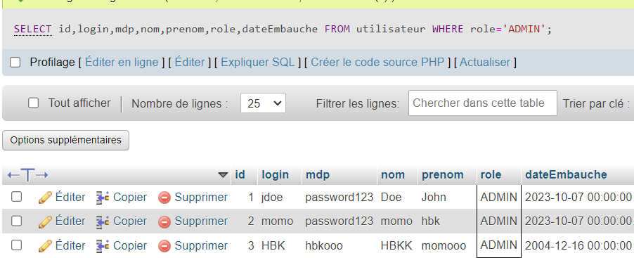

# Mission EasyTrain
## Fall Mouhamad, 04/10/2024

### Modele relationnel

### Utilisateur
Utilisateur(id: int(3), login: varchar(50), mdp: varchar(50), nom: varchar(50), prenom: varchar(50), dateEmbauche: datetime, role: enum('ADMIN', 'EMPLOYE'))
Clé primaire : id 
Clé étrangère : --

### Arret
Arret(id: int(3), nom: varchar(30)) 
Clé primaire : id 
Clé étrangère : --

### Trajet
Trajet(code: varchar(10), tempsDepart: datetime, tempsArrivee: datetime, arretDepartId: int(3), arretArriveeId: int(3))
Clé primaire : code 
Clé étrangère : arretDepartId référence à Arret.id, arretArriveeId référence à Arret.id
Champs unique : --

### Role
Role(enum: 'ADMIN', 'EMPLOYE') 
Clé primaire : -- 
Clé étrangère : --

-------

### Requetes SQL 

### 1°) Récuperer l'utilisateur qui a un login = 'HBK'
SELECT (id,login, mdp, nom, prenom, dateEmbauche, role)
FROM utilisateur
WHERE login= 'HBK';

### 2°) Lister les utilisateurs qui sont admin

SELECT id,login,mdp,nom,prenom,role,dateEmbauche
FROM utilisateur
WHERE role='ADMIN';

### 3°) Récuperer les trajets sur une periode donnée

SELECT code,tempsDepart,tempsArrivee,arretDepartid, arretArriveeid
FROM Trajet
WHERE tempsDepart BETWEEN '<date1>' AND '<date2>'
    AND tempsArrivee BETWEEN '<date1>' AND '<date2>'

### 4°) Ajouter et supprimer un employé avec toute ses informations
INSERT INTO utilisateur (login,mdp,nom,prenom,role,date_embauche)
VALUES ('LeLogin', SHA2('lemdp',256),'LeNom' , 'leprenom', 'EMPLOYE', '<date>')

-------
DELETE FROM utilisateur WHERE id=3 
DELETE FROM utilisateur WHERE login ='leLogin'

### 5°) Modifier le temps d'arrivée d'un trajet avec son code