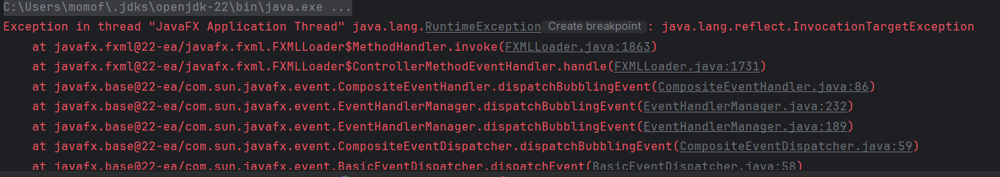

## Fall Mouhamad 24/01/2025


# Enumération des différents éléments modifié


## 1. **Ajout d'un controller et d'une view pour l'ajout d'un arrêt**
j'ai crée un controller arrêt, dans celui-ci il y a une connexion a la bdd "easytrainfx" 
````java
private static final String DB_URL = "jdbc:mariadb://localhost:3306/easytrainfx";
```` 
en creant 4 types d'arret : Terminus,Station,Aire de repos,Autre.

j'ai donc aussi créer une view `AjoutArret-view.fxml` ce qui va permettre d'avoir l'interface de l'application 


## 2 Requêtes SQL utilisées

### 1. **Création de la table `Arrets`**

```sql
## Requêtes SQL utilisées

### 1. **Création de la table `arrets`**

La table `arrets` est utilisée pour stocker les informations des arrêts, comme le nom de l'arrêt, son emplacement et son type (ex. : Terminus, Station, etc.).

```sql
CREATE TABLE arrets (
    id_arret INT AUTO_INCREMENT PRIMARY KEY,
    nom_arret VARCHAR(255) NOT NULL,
    emplacement VARCHAR(255) NOT NULL,
    type_arret ENUM('Terminus', 'Station', 'Aire de repos', 'Autre') NOT NULL
);'
````   


## 3. **Modifications du fichier `EasyTrainApplication.java`**

Au tout debut `EasyTrainApplication.java` permettait d'ajouter des users avec différents types j'ai donc modifié l'app pour pouvoir y ajouter des arrets


## 4 **Mes erreurs au lancements de l'applications `EasyTrainApplication.java`**



Malheursement je ne comprend pas cette erreur, l'application était censé ajouté un arret et on aurait pu le voir dans notre table arret de la bdd

## 5 Contenu de ma base de données 

ma base ne contient que table Arrets qui va permettre de stocker le nom et le type d'arret et users qui va pouvoir aussi stocker le nom et le role de l'utilisateur `(Admin,Client,etc...)` 